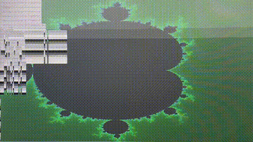

# Display Mandelbrot set using Framebuffer

## Demo



## OS
`Ubuntu 24.04 LTS`

## Run

`Ctrl + Alt + F6`  
Run GUI session: exclusive Framebuffer access.  
Only one process may draw to it. `  (⌐■_■) `  

```shell
cd # project directory
make
```

`Enter`  
A couple times `(¬‿¬)`  

`Enjoy ..  `  
` ('◎_◎ )`  

Terminate the process `(╯°□°）╯︵ ┻━┻`  
`Ctrl + C`  
 
Exit to the previous GUI session `(ಠ_ಠ)`  
`Ctrl + Alt + F1`  
