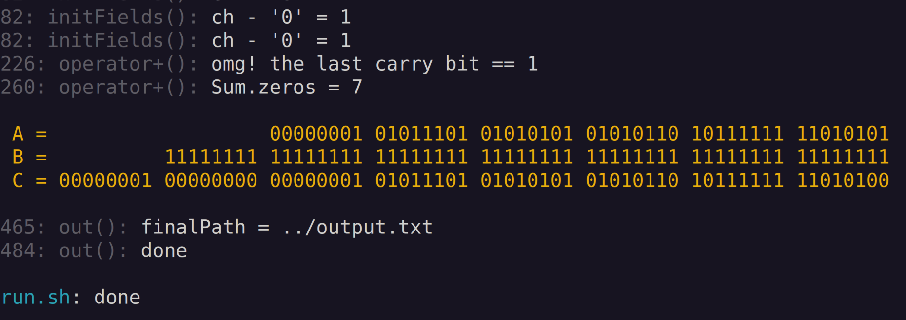

### Addition of Arbitrary-length Binary Numbers in C++

- [x] input.txt: two binary lines  
- [x] console: C = A + B
- [x] output.txt: the result
- [ ] tests
- [ ] CI
- [ ] linter 

### Build & Run

edit `input.txt`  
run `./script/br.sh`  
check console and `output.txt`

### Todo

- [ ] support range-based for loop
- [ ] enumerate arr in reverse order maybe
- [ ] add more functions
- [ ] ignore input spaces
- [ ] support operator[][]
- [ ] convert to class
- [ ] add Windows compatibility
- [ ] refuse memory reallocation if the last carry bit == 1

### Мысли: когда числа действительно произвольной длины, памяти не хватает

- числа могут быть действительно большие.  
  поэтому надо оценивать доступную память

- группируем бинарную строку по `WORD_BITS` и храним в массиве `word_t*` - поле `struct Number`

- будем считать, что для подсчета длины бинарной строки хватает `uint64_t`.  
  это условие почти не ограничивает максимальный вес одного числа:  
  `2^64 (Bit) / 2^43 (Bit / TB) = 2^21 (TB)`

- далее стоит понять, потребуется ли после вычисления суммы сохранять слагаемые.  
  от этого зависит, сколько потребуется памяти для *точного* вычисления `C = A + B`:  
  если `A, B` требуется сохранить: `2 * maxLength + minLength + 2` бит,  
  если `A, B` сохранить не требуется: `maxLength + minLength + 2` бит

- узнаём `length` и оцениваем память  

- если на точные вычисления памяти гарантированно не хватит:  
  записываем `A, B` в порядке `big endian` - считаем все оставшиеся цифры нулями, храним длину хвоста.
  получаем `C` приближенно в порядке `little endian`

### Изучить, повторить:

- [ ] https://lamagraph.github.io/intro-to-fpga-with-clash/

- [ ] OCaml базово

- [ ] Архитектура компьютера:
        процессор, различные виды памяти, шины (данных, команд), периферийные устройства, их подключение

- [ ] Архитектура процессора:
        триггеры, регистры, кэши, АЛУ, тактовый генератор 

- [ ] Представление данных: 
        байт, бит, машинное слово, целые, с плавающей точкой

- [ ] Целочисленная арифметика, битовые операции, переполнение
